## About me

Hi, I'm Juan Ospina, a fullstack engineer, frontend-oriented, with 14 years of experience. I care about performance, clean code, reusability and building things people actually use. Since I was a kid I wanted to be an inventor and software was the place I found where I could channel that creative energy. 
Right now I am heavily invested in AI and the possibilities it opens. MoMo, my personal finance product, is my first attempt at building a whole product from design, UX, UI, BE up to data base modeling. I used it as a playground to explore how AI agents can be build, how to eval them and improve them.
Aluna on the other side is a PoC where I want to explore new possibilities for AI beyond just code generation by building a self-building CRUD app where intent is shaped into a working feature.

## Stack

## What I'm building

### [Aluna](https://github.com/jcospina/aluna)

> **Describe what you want to keep track of. Aluna turns it into a working personal app while you watch.**

Aluna is an active research prototype for an app that shapes itself around your intent. It begins with a small shell and no predefined domain model. When you ask for a capability (notes, recipes, a reading diary, or something entirely your own) Aluna uses AI to define it, build it, check it, and keep the result locally.

The platform owns the shell, routing, storage boundaries, shared presentation, and safety checks. AI authors each capability's data shape, behavior, presentation intent, and executable actions.

[**Explore the architecture →**](https://jcospina.github.io/aluna/) · [Repo](https://github.com/jcospina/aluna) · [Roadmap](https://github.com/jcospina/aluna/blob/main/docs/modules.md)

---

### [MoMo](https://github.com/jcospina/momo)

> **Personal finances made easy.**

A chat first personal finance app. Log expenses by typing messages, track spending with visual analytics, and collaborate with your household in real time.

[**Live at momo.joq.dev →**](https://momo.joq.dev) · [Repo](https://github.com/jcospina/momo) · [Architecture](https://github.com/jcospina/momo/blob/main/docs/architecture.md)

## Contributions

